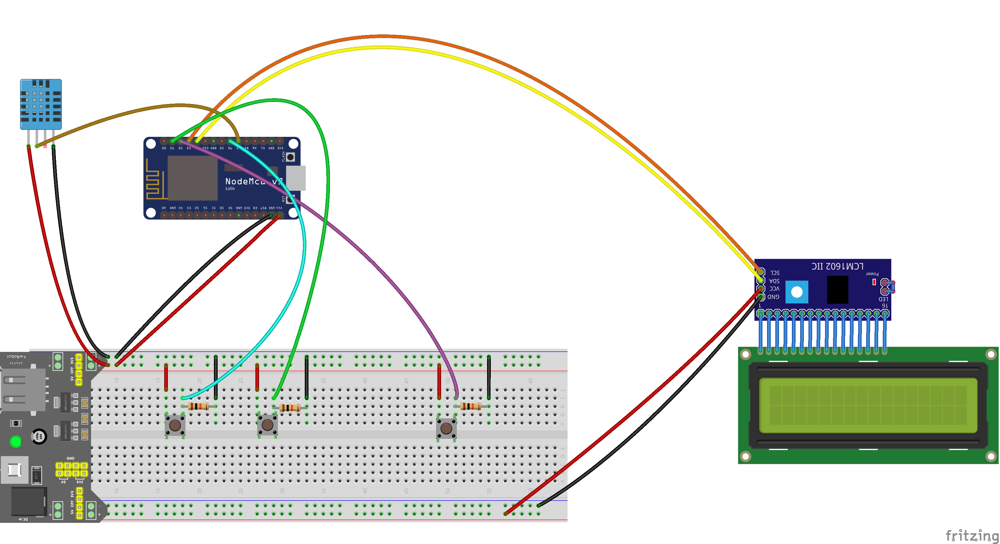

# sensorio-displayer
Use the LiquidCrystal to display temperature and humidity.

Before using the NodeMCU you can test the LiquidCrystal display with an Arduino with the `test-arduino` sketch.
You can alse test the connection between your NodeMCU and the Senorio Hub with the `test-url` sketch

Then you can make this and use the `display-sensor` sketch:

The button connected on D1 is to toggle the light.  
The button connected on D2 is to show more informations.   
The button connected on D6 is to switch on the light for 5s.  

You will need to add a Weather Station to the Sensorio Hub. 